# Benchmark Results

Base model: `SmolLM2-1.7B-Instruct` | Fine-tuned: `lyra-merged`

## Summary

| Benchmark | Category | Metric | Base | Lyra | Delta |
|-----------|----------|--------|------|------|-------|
| mmlu | knowledge | acc | 0.5012 | 0.4604 | -0.0409 |
| arc_challenge | knowledge | acc_norm | 0.4500 | 0.5000 | +0.0500 |
| hellaswag | knowledge | acc_norm | 0.6600 | 0.6500 | -0.0100 |
| tool-call-format | custom | pass@1 | 0.4065 | 0.1870 | -0.2195 |
| code-syntax | custom | pass@1 | 0.2000 | 0.2000 |  0.0000 |

## Score Comparison

```mermaid
xychart-beta
    title "Base SmolLM2-1.7B-Instruct vs lyra-merged"
    x-axis ["mmlu", "arc_challenge", "hellaswag", "tool-call-format", "code-syntax"]
    y-axis "Score" 0 --> 1
    bar [0.5012, 0.4500, 0.6600, 0.4065, 0.2000]
    bar [0.4604, 0.5000, 0.6500, 0.1870, 0.2000]
```

